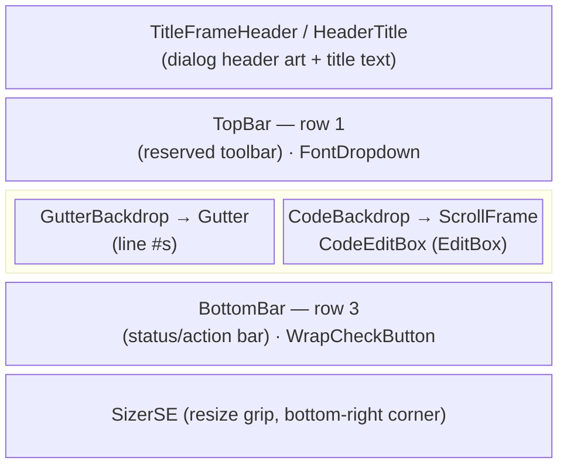
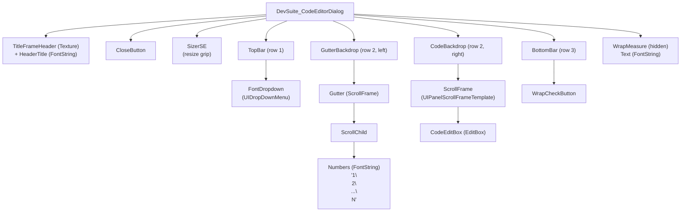

# CodeEditor

Standalone (non-Ace3) line-numbered code editor dialog prototype. Not wired into
the DevSuite namespace/module registry -- see [issue #90](https://github.com/kapresoft/wow-DevSuite/issues/90).

## Files

| File | Role |
|---|---|
| `CodeEditorDialog.xml` | Frame layout (`DevSuite_CodeEditorDialogTemplate`) |
| `CodeEditorDialog.lua` | `DevSuite_CodeEditorDialogMixin` -- gutter sync, wrap mode, font switching |
| `CodeEditBoxMixin.lua` | Mixin for the `CodeEditBox` EditBox |
| `Fonts.xml` | Font definitions (Ubuntu Mono, JetBrains Mono, Source Code Pro) |
| `Assets/` | Bundled monospace font files |

## Visual layout

The dialog is a fixed-header/footer frame with a scrollable body row in between.
Row order, top to bottom:



<details>
<summary>Plain-text fallback</summary>

```
+---------------------------------------------------------+
|                 TitleFrameHeader / HeaderTitle           |  <- dialog header art + title text
+---------------------------------------------------------+
| TopBar                                     [FontDropdown]|  <- row 1: reserved toolbar
+---------------------------------------------------------+
| GutterBackdrop | CodeBackdrop                            |
|  +-----------+ |  +-------------------------------+      |
|  | Gutter    | |  | ScrollFrame                    |     |  <- row 2: gutter + code
|  | (line #s) | |  |  CodeEditBox (EditBox)          |     |
|  +-----------+ |  +-------------------------------+      |
+---------------------------------------------------------+
| BottomBar   [WrapCheckButton]                            |  <- row 3: status/action bar
+---------------------------------------------------------+
                                          [SizerSE resize] ->
```

</details>

## Frame hierarchy



`WrapMeasure` is an offscreen helper: it mirrors `CodeEditBox`'s font/width so
`GetNumLines()` can tell wrap mode how many visual rows a logical line occupies.

## Gutter / EditBox sync

The gutter (`Gutter`) and the code area (`ScrollFrame`) are two independent
`ScrollFrame`s. Three separate mechanisms keep their rows pixel-aligned,
all in `RefreshGutter()` and its scroll/size hooks:

1. **Same font, same pitch.** `Numbers` (the gutter's FontString) and
   `CodeEditBox` always share one font object (`SetCodeFont` calls
   `SetFontObject` on both together). Since line height comes entirely from
   the font/text engine, rendering both columns' text in the identical font
   guarantees identical line pitch -- no per-line Y math is needed.

2. **Same content height.** `RefreshGutter()` measures
   `numbers:GetStringHeight()` after setting the gutter text, then applies
   that height to *both* `child` (the gutter's ScrollChild) and
   `CodeEditBox`. Sizing both scroll children to the same content height
   gives their `ScrollFrame`s an identical scroll range, so a given scroll
   offset always corresponds to the same line in both.

3. **Locked scroll position.** The code `ScrollFrame`'s `OnVerticalScroll`
   handler (`OnCodeEditBoxScroll`) calls `self.Gutter:SetVerticalScroll(offset)`
   directly -- the gutter never scrolls on its own input; it only mirrors the
   code area's real `ScrollFrame` API, the same mechanism WoW uses for any
   scroll frame, so clipping behaves identically for both.

`RefreshGutter()` re-runs on every text change, size change, wrap toggle, and
font change (`OnCodeEditBoxTextChanged`, `OnCodeEditBoxSizeChanged`,
`SetWrapText`, `SetCodeFont`), so the three invariants above are re-established
any time something could have invalidated them.

**Wrap mode** adds a fourth piece: since one logical line can span multiple
*visual* rows once wrapped, `WrappedLineNumbersText()` uses the hidden
`WrapMeasure.Text` (same font and width as `CodeEditBox`) to ask
`GetNumLines()` how many visual rows each logical line will occupy, then
emits that line's number followed by `(rows - 1)` blank lines. This keeps the
gutter's row count matching the code's *visual* row count rather than its
logical line count, so numbers still land next to the correct wrapped text.

## Configuration

The dialog is designed to be usable as a future standalone library, before
any settings source (SavedVariables DB, AceConfig, etc.) exists. It never
reaches into one itself -- the host addon owns reading/writing settings and
just calls into these two methods:

- **`o:Configure(options)`** -- applies initial or programmatic settings.
  `options` is a partial table (`fontFamily`, `fontSize`, `wrapText`); any
  omitted field keeps its current value, merged over `DEFAULTS` on first
  call. Safe to call before or after `:Show()`. Does **not** fire
  `OnConfigChanged` -- the caller already knows what it just set.
- **`o:SetOnConfigChanged(callback)`** -- registers `callback(self, options)`,
  fired once per *user-driven* change (font dropdown pick, wrap checkbox
  click). `options` is always a **full snapshot** of `GetOptions()` --
  `fontFamily`, `fontSize`, and `wrapText` together, regardless of which one
  the user actually changed. Callers that persist settings can just do
  `DB.profile.codeEditor = options` with no merge logic of their own.

`fontFamily` is a stable key into `FONT_CHOICES` (e.g. `'UbuntuMono'`),
independent of the dropdown's display label so relabeling a font later won't
break persisted config. `fontSize` is accepted and echoed through `Configure`/
`GetOptions`/the callback, but not yet applied to rendering -- `Fonts.xml`
hardcodes a fixed height per font object today, with no live font-size API
wired in.

## Behavior notes

- **No-wrap mode** (default): `CodeEditBox` is fixed at 4000px wide, wider than
  the viewport, so lines never reach a wrap boundary.
- **Wrap mode**: `CodeEditBox` is pinned to the `ScrollFrame` width; the gutter
  emits a blank line per extra wrapped row so numbering stays visually aligned.
- **Fonts**: switching the dropdown calls `SetFontObject` on `CodeEditBox`,
  `Gutter.ScrollChild.Numbers`, and `WrapMeasure.Text` together, since
  `inherits="..."` in XML only binds once at load.
- **Notify flag**: `SetCodeFont`/`SetWrapText` take an optional `notify`
  argument -- `true` fires `OnConfigChanged` (used by the dropdown/checkbox
  handlers), omitted for internal/initial sets (`OnLoad`, `Configure`).