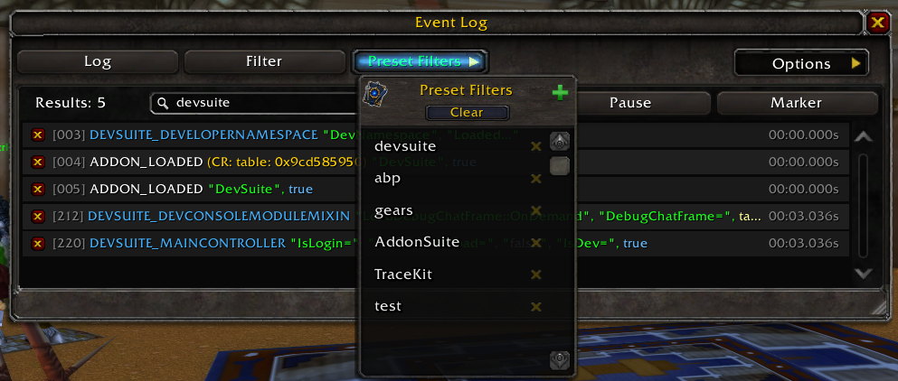

DevSuite
==================

[Releases](https://github.com/kapresoft/wow-addon-devsuite/releases) | [Milestones](https://github.com/kapresoft/wow-addon-devsuite/milestones) | [Known Issues](https://github.com/kapresoft/wow-addon-devsuite/issues) | [CurseForge](https://legacy.curseforge.com/wow/addons/devsuite/files)

### Description

DevSuite is a toolkit for World of Warcraft addon developers, offering an intuitive debug dialog UI, event tracing, frame inspection, and other tools to streamline debugging and optimize your add-on development workflow.

## Highlights

-   In-game Lua eval dialog — test snippets and inspect return values without leaving WoW.
-   Global `tr(...)` tracing function (via LibTraceKit) plus `/etrace` event tracing — see what's firing, when.
-   "Get Details on Mouse Over" — inspect any UI frame/widget just by hovering.
-   Toggle Blizzard's Frame Stack tool via keybind — no more typing `/fstack`.
-   Ready-made preset filters for `/etrace` — cut through event noise fast.
-   Save and switch between up to 15 debugging sessions effortlessly.
-   Automated FPS display for performance monitoring.
-   Dedicated Debug Chat Frame tab (via DebugChatFrame) for a clean, filterable log console.
-   `/devsuite` slash commands for quick access to the debug dialog, config, and console.
-   `Dump Cursor Info` keybind for inspecting spells, macros, and mounts under your cursor.
-   Ace3 profile support for per-character/per-spec dev settings.
-   Key actions (Debug Dialog, Get Details On Mouse Over, Toggle Frame Stack, and more) can be bound to keys via WoW's native Key Bindings UI.

### Key Features

#### Debug UI Evaluation Tool

Evaluate Lua on the fly and save the snippets you use often. Switch between up to 15 saved debugging sessions, so you're not rewriting the same throwaway code every time you reload.

#### Tracing with LibTraceKit

Call the global `tr(...)` function anywhere in your code to emit tagged trace output to the trace UI — no need to wire up your own logging.

```
Syntax: tr('<tag-name>', ...)
```

Example:

```
tr('EventListener', 'var1=', var1, 'tableVal=', fmt({ 1, 2, 3 }))
```

Open the trace UI (`/etrace`) and filter for `DEVSUITE` to see the trace line:

```
DEVSUITE_EVENTLISTENER "var1=" "<value>", etc...
```


#### Preset Filters for `/etrace`

Filter WoW's event stream with ready-made presets instead of typing event names by hand. Jump straight to the events you care about and cut out the noise when watching `/etrace` output.



#### Get Frame On Mouse Over

Hover over any UI element to identify the exact frame beneath the cursor, with its details surfaced instantly. No more guessing frame names or digging through `/fstack` output by hand.

#### Toggle Frame Stack

Bind a key to instantly bring up Blizzard's Frame Stack tool — no more typing `/fstack` every time you need it. Frame Stack shows you the full frame hierarchy under your cursor, including frame names, sizes, and layers, which makes it invaluable for tracking down anchor issues, taint sources, and z-order/click-through problems while you iterate.

#### Debug Chat Frame

Enable a dedicated Debug Chat Frame tab (requires the optional [DebugChatFrame](https://www.curseforge.com/wow/addons/debugchatframe) addon) to keep debug/trace output separate from your regular chat log. Configurable font size, max line count, and can be set as your default chat frame.

#### FPS Display

An always-available FPS readout for quick performance checks while you iterate.

#### Slash Commands

```
/devsuite (or /ds) [option]
  config    - Shows the config UI
  dialog    - Toggles the debug dialog UI
  clear     - Clears the debug console (aliases: cls, clr)
  info      - Prints additional info about the addon
  help      - Shows this help

/devsuite-options (or /ds-options) - Opens the Ace3 config command line options
```

#### Dump Cursor Info

Bind a key to `Dump Cursor Info` to inspect whatever's currently on your cursor — spell, macro, mount, or companion — and dump its details straight to your chat log. Handy for grabbing spell IDs and macro indices while you work.

#### Ace3 Profile Support

Your DevSuite settings follow Ace3 profiles, so per-character or per-spec configurations switch automatically with your profile.

### Donations

If DevSuite has made your addon development easier, consider supporting its development:

- **[Paypal&trade; Donation](https://www.paypal.com/donate/?hosted_button_id=AX58YP3GSGXVU)**
- **[Bitcoin Donation](https://www.blockchain.com/btc/address/3QQVAwJGkKHMM2oq6CLVWYgfx83TFVwp39)**

## About

- About the Author [(Tony Lagnada)](https://tony.resume.lagnada.com/)
- My AddOn Portfolio Can Be Found Here [Curse Forge/Kapresoft](https://www.curseforge.com/members/kapresoft/projects)
